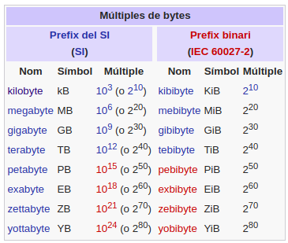
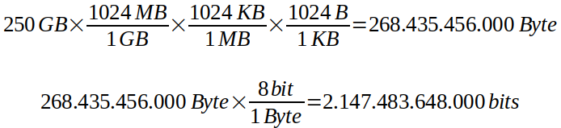

Codificació de la informació
============================


* [Resum](https://gitpitch.com/jrodr236/som/master?p=CodificacioDeLaInformacio)
* Exercicis teòrics: *moodle*
* Exercicis pràctics: *no n'hi ha.*


Definició de la informació
--------------------------

La **informació** és el resultat de la manipulació de les *dades*.


La **informació** és tota forma de representació de fets, objectes,
valors, idees, etc., que permet la comunicació entre persones i
l’adquisició del coneixement de les coses.

Elements de la informació
-------------------------

La **informació** és formada per les dades. Les dades s’utilitzen per a
produir informació que ens ajuda a prendre decisions.

Les **dades** són fets o objectes que no han estat manipulats.

Els tipus de dades *bàsics* utilitzats pels ordinadors son:

-   **Numèriques**. Formades per nombres (0, 1, ..., 9).
-   **Alfabètiques**. Formades per lletres (A, B, ..., Z).
-   **Alfanumèriques**. Formades per tots els caràcters.


Els ordinadors també emmagatzemen dades complexes: *imatges, audio, vídeo, etc...*


Un **codi** és la manera diferent d’interpretar una mateixa informació.

> Per exemple, el símbol X, fent servir el codi alfabètic, és una
    lletra, mentre que si apliquem el codi de les xifres romanes és el
    nombre 10.


El sistema binari
-----------------

Per a un ordinador totes les dades són nombres: les xifres, les lletres,
qualsevol símbol, i fins i tot les instruccions són nombres.

Qualsevol quantitat, frase o dada s’emmagatzema en forma de zeros i uns.

L’ordinador utilitza un sistema de numeració diferent del sistema
decimal: **el sistema binari**.


L’ordinador pot representar les dades bàsiques de dues maneres:

-   mitjançant sistemes numèrics
-   mitjançant codis alfanumèrics

Mesura de la informació
-----------------------

El **bit** és la unitat base de mesura de la informació, que indica la
quantitat mínima que forma la informació. Es representa mitjançant dos
símbols, 0 i 1, anomenats bits.

Un grup de vuit bits s’anomena **byte**. Aquest grup també es coneix amb
el nom d’octet.


Prefixos d’ús convencional en informàtica
-----------------------------------------



*https://ca.wikipedia.org/wiki/Byte*

En general s'acostumen a utilitzar els prefixos amb múltiples binaris, però a vegades hi han confusions:

* 1.024 (2¹⁰) no és 1.000 (10³).
* 1 kilobyte és diferent de 1 kilobit.


Es recomana que el bit es representi amb el símbol b i el byte amb el
símbol B.

> Exemple de conversió d'unitats de mesura:
tenim un fitxer al disc dur d'exactament 250 GB. A quants bytes i
bits equival?




Sistemes de representació de la informació numèrica
------------------------------------------

Un **sistema de numeració** permet representar la informació numèrica
per mitjà de dades de significació numèrica i operar-hi, amb uns símbols
i unes regles determinats.

Un **sistema de numeració** és el conjunt dels símbols i les normes que
s’utilitzen per a la representació de la informació numèrica.

En tot sistema de numeració hi ha una base del sistema que indica el nombre de símbols que podem utilitzar. La notació és: *(base*.

Els **sistemes de numeració** són conjunts de dígits utilitzats per a
representar quantitats.

Sistemes de numeració amb base:
* decimal (10)
* binari (2)
* octal (8)
* hexadecimal (16)
* etc...

Sistemes de numeració sense base:
* romà (utilització més complicada).

Una **magnitud analògica** -com una tensió elèctrica o la velocitat-
pot tenir qualsevol valor dins d’un interval continu.

> Per exemple, la tensió a la sortida d’un micròfon podria ser dins de
    qualsevol valor entre 0 mV i 10 mV.

En la **representació digital**, les quantitats –representades per
dígits– no poden tenir qualsevol valor, sinó sols valors discrets.

> Per exemple, un rellotge digital marca el temps del dia en forma de
dígits decimals (hores, minuts i segons). Ara bé, el temps varia d’una manera contínua, però la posició de les busques del rellotge
no varia d’una manera contínua, sinó a passos (segons). És a dir, el
rellotge només pot donar valors discrets.


Un **sistema digital** és una combinació de dispositius (generalment
electrònics) dissenyada per a manipular quantitats físiques o informació
que estigui representada de manera digital

> Per exemple, els ordinadors, les calculadores digitals, els equips
d’àudio i vídeo digital, els telèfons intel·ligents *(smartphones)*, etc.

La tecnologia digital utilitza molts sistemes de nombres. Els més comuns
són:

### Sistema binari.
És el sistema de numeració que utilitzen internament els circuits digitals que configuren el maquinari dels ordinadors
        actuals.

* Base: 2.
* Símbols: 0 i 1 (bits).
* Una combinació de vuit bits s’anomena byte

> Per exemple: `10011001`

### Sistema decimal.

És el més conegut.

-   Base 10.
-   Símbols: 0, 1, 2, 3, 4, 5, 6, 7, 8, i 9.

### Sistema hexadecimal.

Com que és molt fàcil la conversió amb el sistema binari, l'hexadecimal s'utilitza molt per representar números en binari d'una forma més compacta.

* Base 16.
* Símbols: 0, 1, 2, 3, 4, 5, 6, 7, 8, 9, A, B, C, D, E, F.


Conversió entre sistemes de numeració
----------------------------------

El **teorema fonamental de la numeració** (TFN) permet fer conversions entre diferents sistemes de nomeració. Aquest teorema diu que el valor decimal
d’una quantitat expressada en altres sistemes de numeració s’expressa
segons el polinomi següent:

... + x<sub>4</sub>b⁴ + x<sub>3</sub>b³ + x<sub>2</sub>b² + x<sub>1</sub>b¹ + x<sub>0</sub>b⁰ + ...

en què el símbol b representa la base i x són els dígits del nombre.

> Exemple d’aplicació del teorema fonamental de la numeració:
>
> Representeu el 4123(5 en base 10 segons el teorema fonamental de la numeració.
>
> Solució: 4123(5 = 4 x 5³ + 1 x 5² + 2 x 5¹ + 3 x 5⁰ = 500 + 25 + 10 + 3 = 538(10


Hi han altres mètodes per fer conversions entre sistemes de numeració:
* Regla de Ruffini
* Divisions successives per la base.
* Conversió directa utilitzant taula (binari-hexadecimal).

```
0 0000
1 0001
2 0010
3 0011
4 0100
5 0101
6 0110
7 0111
8 1000
9 1001
A 1010
B 1011
C 1100
D 1101
E 1110
F 1111
```

Exemple: `A4(16 =  1010 0100(2`

Operacions bàsiques amb sistemes de numeració
---------------------------------------------

De la mateixa manera que en el sistema de numeració decimal podem fer
les operacions bàsiques de càlcul (suma, resta, multiplicació i
divisió), en el sistema binari octal i hexadecimal també les podem fer.


Representació dels nombres enters
---------------------------------

Els ordinadors poden fer servir diferents mètodes per a representar
internament els nombres enters, positius i negatius. Entre altres
mètodes destaquen:

-   Decimal empaquetat (més senzills per a les persones)
-   Mòdul i signe.
-   Complement a 1.
-   Complement a 2.
-   Excés a 2<sup>n</sup>–1. (simplifiquen operacions aritmètiques a l'ordinador)

La **paraula** és el nombre de bytes que pot gestionar l’ordinador, és a
dir, el nombre de bits que l’ordinador és capaç de manipular per a fer
operacions internes. Aquesta quantitat depèn del disseny de la màquina:
hi ha ordinadors amb paraules de 8, 16, 32 i 64 bits. Per això, la
representació d’un mateix nombre serà diferent en màquines de paraules
diferents.

>   Per exemple, un ordinador amb paraula de 8 bits pot treballar amb 2⁸
    = 256 combinacions diferents, i un de 32 bits amb 2³² =
    4.294.967.200.


Representació dels nombres amb xifres decimals
-----------------------------------

Els mètodes principals per a representar nombres amb xifres decimals son:

-   En coma fixa.
-   En coma flotant.


Sistemes de representació de la informació alfanumèrica
----------------------------------------

L’ordinador només entén la informació en forma de senyals elèctrics que
nosaltres representem mitjançant dos símbols, el 0 i l’1. L'ordinador
treballa i opera seguint les regles de l’aritmètica binària.

Els dispositius d'entrada/sortida (ex: teclat) transmeten els caràcters
per mitjà d'un tren d'impulsos seguint els anomenats **codis externs**.

A l'interior l’ordinador s’utilitza un únic codi binari per a totes les
dades, independentment d’on vinguin. Aquest codi s’anomena **codi
intern** o codi alfanumèric, i és diferent d’un fabricant a un altre.

>   Exemple: IBM fa servir el codi EBCDIC als grans ordinadors, i als
    microordinadors clàssics aplica el codi ASCII.

Hi ha d’haver una conversió de codis entre formes externes i internes.   Aquesta conversió es pot fer dins del mateix dispositiu d’entrada,
    dins del processador, abans d’arribar al processador, en un
    dispositiu anomenat interfície o connexió.


En tot aquest procés de transmissió de la informació, hi ha un sistema
de control d’errors per a assegurar que les dades arribin correctament a
la destinació.

>   Exemple: control de paritat.
>    -   Paritat parella. El nombre total de bits 1 en cada byte ha de
        ser parell; si no, en el bit de paritat es posa un 1 i, en cas
        contrari, es posa un 0.
>    -   Paritat senar. El nombre total de bits 1 en cada byte ha de ser
        senar; si no, en el bit de paritat es posa un 1 i, en cas
        contrari, es posa un 0.


Codificació interna de les dades
------------------------------

Es denomina **codificació** la manera diferent d’entendre un mateix
símbol en funció del sistema d’avaluació que fem servir.

-   Exemple: No té el mateix significat el símbol X interpretat com a
    lletra que com a nombre en el sistema de codificació romana.

Tenim diferents sistemes de codificació interna de les dades:

-   Codi **ASCII**. És el codi classic que s'ha fet servir per a
    representar cada caràcter en forma d’un byte i que s’aplica
    principalment en els microordinadors.
-   Codi **EBCDIC**. També és un codi de 8 bits i s’aplica principalment
    en grans ordinadors.
-   Codi **Unicode**. És el més modern i cada cop s'utilitza més. És un codi de 32 bits; per tant, el nombre de
    caràcters que podem representar és de 2³²: 4.294.967.296 caràcters (tots
    els idiomes, no només l'alfabet llatí com els anteriors, i emojis, símbols matemàtics, tècnics, musicals, etc...).


