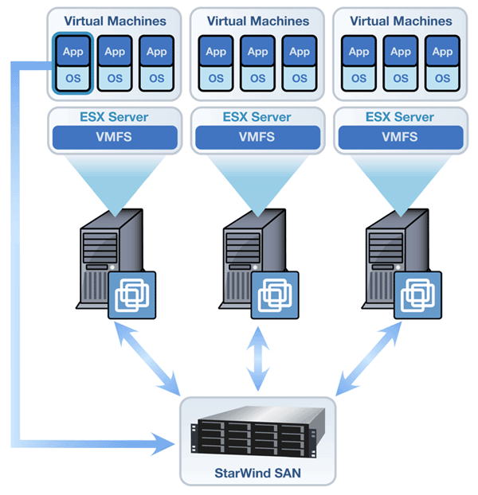
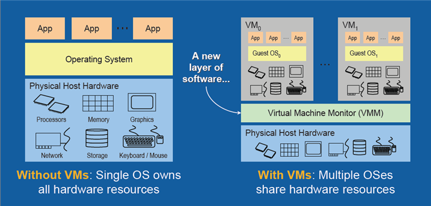
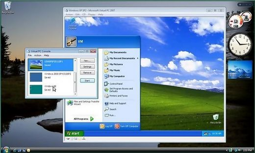

# Màquines virtuals

[Teoria](https://jrodr236.github.io/som/MaquinesVirtuals)

---

## Introducció
Ús: molts àmbits

+++

Entorn d'escriptori

+++

Entorn empresarial

---

## Maquina real i màquina virtual
Virtual simula funcionament de la real

+++

---

## Virtualització
Varis sistemes operatius funcionant alhora

---

## Amfitrió i hoste
Amfitrió: Sistema operatiu a on s'executen les Màquines Virtuals

Hoste: Sistema operatiu instal·lat a cada Màquina Virtual.

+++

---

## Tipus de màquines virtuals

* Màquines virtuals de sistema
* Màquines virtuals de procés
* Virtualització de recursos

---

## Avantatges i inconvenients de les màquines virtuals

+++

### Avantatges

* Consolidació de servidors
* Recuperació davant desastres
* Proves d’aplicacions
* Execució d’entorns complets sense instal·lació i configuració
* Aplicacions portàtils

+++

### Inconvenients

* Afegeixen complexitat (més lent)
* Treuen recursos a la màquina real
