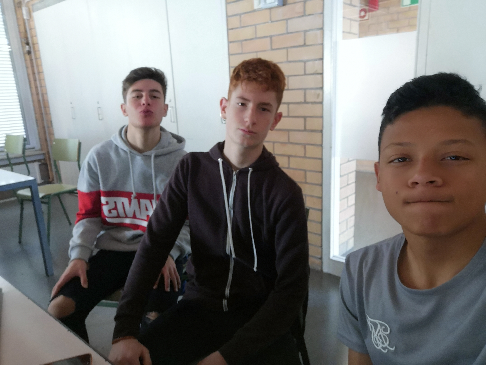
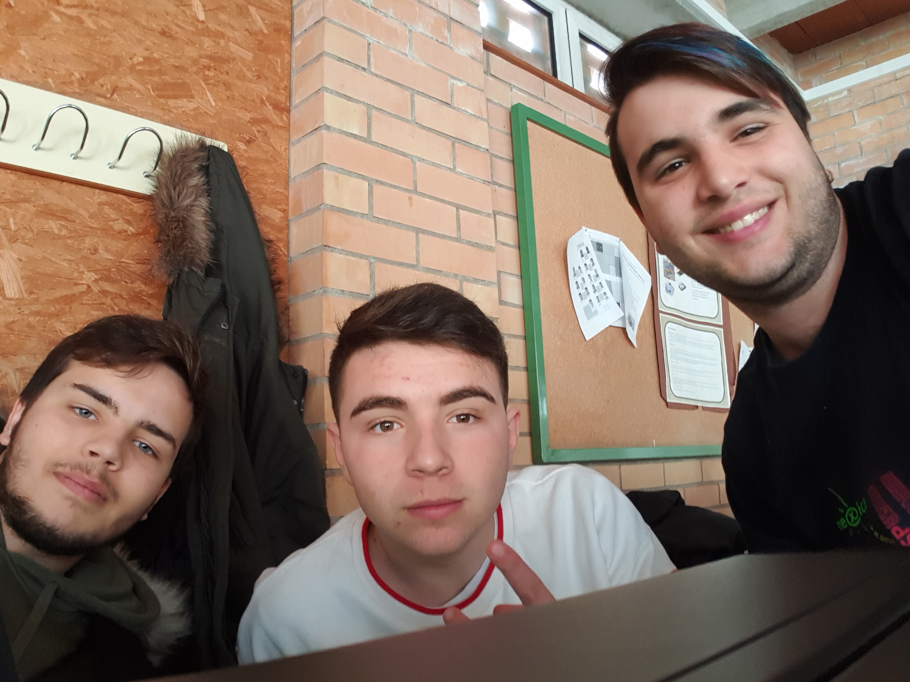
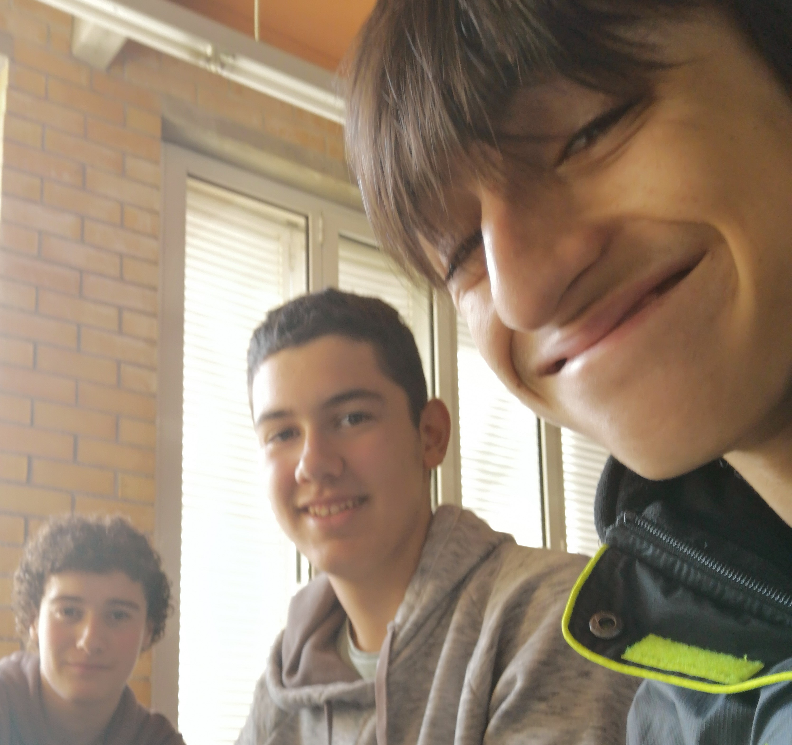
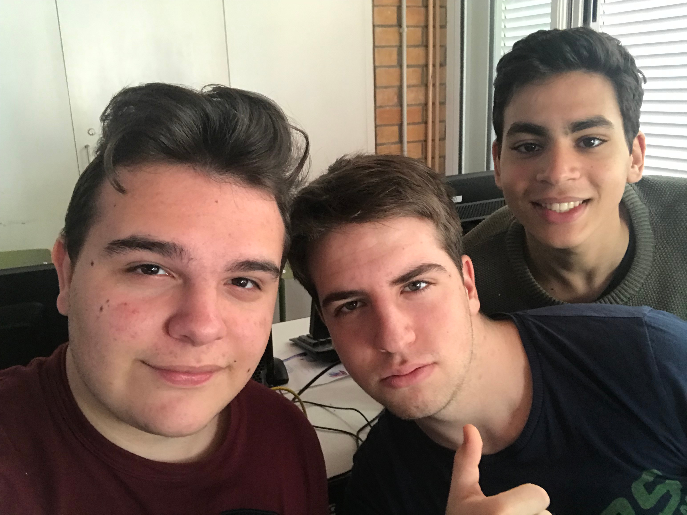
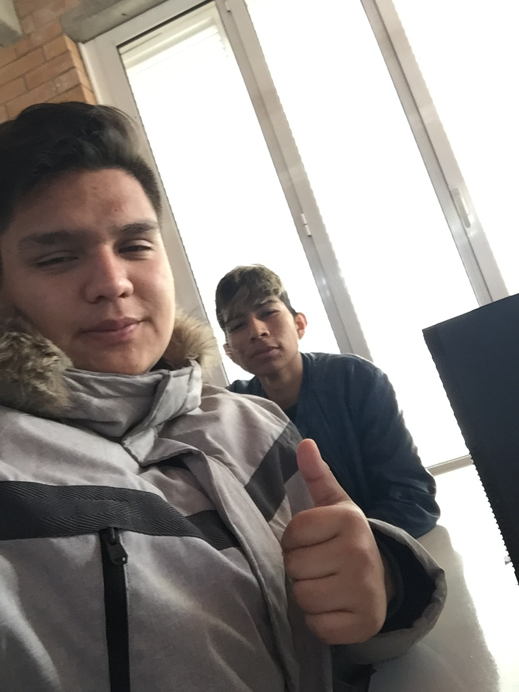
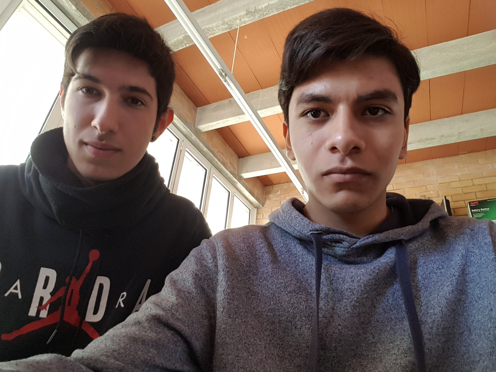
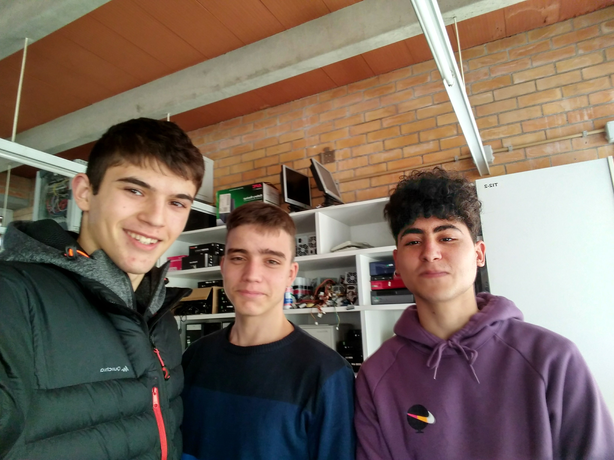

Projecte UF3: campionats mundials d'esports per a cecs
==================================================

Descripció
----------

Farem el sistema informàtic per al campionat d'un esport per a cecs.

Utilitzarem els servidors Dell.

Ho farem en grups. Han de sortir 5 grups per classe (~3 persones per grup)

[NO EXPLICAR-HO] Utilitzarem la metodologia [Scrum](https://ca.wikipedia.org/wiki/Scrum).

Un cop fets els grups, haureu d'escollir un esport (no es poden repetir). Aquí teniu alguns [exemples d'esports per a cecs](https://www.fcecs.cat/esports/).

Feu-vos un selfie amb els integrants del grup, i envieu-lo per correu al professor, incloent l'esport escollit i els vostres noms.

1 SMX A
-------

### Atletisme

  


* Alumnes
  * Dani Aguilar
  * Dennis Corrales
  - Urkai Alkonso
* Requeriments
  1. ~~Instal·lar el sistema operatiu~~ -> 7 (falta /home separada, 18.10)
  2. ~~Crear usuaris de forma massiva~~ -> 10
  3. ~~Accedir al sistema remotament~~ -> 10
  4. ~~Crear manual d'ús de comandes de gestió d'arxius~~ -> 10
  5. ~~Afegir informació de benvinguda~~ -> 10
  6. ~~Mantenir el sistema actualitzat~~ -> 10
  7. ~~Configurar xarxa~~ (172.21.4.10-fet) -> 10
  8. ~~Backup~~ -> 10
  9. Recuperar servidor (RASP310)
  10. Afegir àrbitres
  ---
  11. Suprimir accés a un usuari
  12. Eliminar Resum.txt
  13. Crear una nova partició
  14. Fer un únic reglament
  15. Bústia de suggeriments
  16. Notícies
  17. No permetre accés a arxius de l'usuari esborrat
  18. Crear servidor web
  19. Gestionar servidor web
  20. Gestionar processos
  21. Automatitzar backups
  22. Monitoritzar /home
  23. Fitxers amb drets d'escriptura en el seu grup

### Judo



* Alumnes
  - Roger Coromina
  - Oriol Basols
  - Sergi Pujol
* Requeriments
  1. ~~Instal·lar el sistema operatiu~~ -> 8 (falta swap, 16.04)
  2. ~~Crear usuaris de forma massiva~~ -> 10
  3. ~~Accedir al sistema remotament~~ -> 10
  4. ~~Crear manual d'ús de comandes de gestió d'arxius.~~ -> 10
  5. ~~Afegir informació de benvinguda~~ -> 10
  6. ~~Mantenir el sistema actualitzat~~ -> 10
  7. ~~Configurar xarxa~~ (172.21.4.9-fet) -> 10
  8. ~~Backup~~ -> 10
  9. Recuperar sistema (RASP309)
  ---
  10. Afegir àrbitres
  11. Suprimir accés a un usuari
  12. Eliminar Resum.txt
  13. Crear una nova partició
  14. Fer un únic reglament
  15. Bústia de suggeriments
  16. Notícies
  17. No permetre accés a arxius de l'usuari esborrat
  18. Crear servidor web
  19. Gestionar servidor web
  20. Gestionar processos
  21. Automatitzar backups
  22. Monitoritzar /home
  23. Fitxers amb drets d'escriptura en el seu grup

### Goalball



* Alumnes
  - David Garcia
  - Pau López
  - Jaume Casamitjana
* Requeriments
  1. ~~Instal·lar el sistema operatiu~~ -> 7 (falta /home separada, 16.04)
  2. **Crear usuaris de forma massiva**
  3. ~~Accedir al sistema remotament~~ -> 10
  4. ~~Crear manual d'ús de comandes de gestió d'arxius.~~ -> 10
  5. **Afegir informació de benvinguda**
  6. ~~Mantenir el sistema actualitzat~~ -> 10
  7. ~~Configurar xarxa~~ (172.21.4.37-fet) -> 10
  8. Backup
  9. Recuperar servidor (RASP3XX)
  ---
  10. Afegir àrbitres
  11. Suprimir accés a un usuari
  12. Eliminar Resum.txt
  13. Crear una nova partició
  14. Fer un únic reglament
  15. Bústia de suggeriments
  16. Notícies
  17. No permetre accés a arxius de l'usuari esborrat
  18. Crear servidor web
  19. Gestionar servidor web
  20. Gestionar processos
  21. Automatitzar backups
  22. Monitoritzar /home
  23. Fitxers amb drets d'escriptura en el seu grup

### Escacs
  


- Xavier Canal
- Iu Bartrina
- ~~Faisal Aaychi~~
* Requeriments
  1. ~~Instal·lar el sistema operatiu~~ (18.10) -> 7
  2. ~~Crear usuaris de forma massiva~~ -> 10
  3. ~~Accedir al sistema remotament~~ -> 10
  4. **Crear manual d'ús de comandes de gestió d'arxius.**
  5. ~~Afegir informació de benvinguda~~ -> 10
  6. ~~Mantenir el sistema actualitzat~~ -> 10
  7. ~~Configurar xarxa~~ (172.21.4.5-fet) -> 10
  8. ~~Backup~~ -> 10
  9. ~~Recuperar Sistema (RASP305)~~ -> 10
  10. Afegir àrbitres
  11. ~~Suprimir accés a un usuari~~ -> 10
  12. Eliminar Resum.txt
  ---
  13. Crear una nova partició
  14. Fer un únic reglament
  15. Bústia de suggeriments
  16. Notícies
  17. No permetre accés a arxius de l'usuari esborrat
  18. Crear servidor web
  19. Gestionar servidor web
  20. Gestionar processos
  21. Automatitzar backups
  22. Monitoritzar /home
  23. Fitxers amb drets d'escriptura en el seu grup

### Esquí




* Alumnes
  - Juan José Correa
  - Alex Franco
  - Dani Benítez
* Requeriments
  1. ~~Instal·lar el sistema operatiu~~ -> 10 (16.04)
  2. **Crear usuaris de forma massiva**
  3. ~~Accedir al sistema remotament~~ -> 10
  4. ~~Crear manual d'ús de comandes de gestió d'arxius~~ -> 10
  5. **Afegir informació de benvinguda**
  6. ~~Mantenir el sistema actualitzat~~ -> 10
  7. ~~Configurar xarxa~~ (172.21.4.77-fet) -> 10
  8. Backup
  ---
  9. Recuperar servidor (RASP3XX)
  10. Afegir àrbitres
  11. Suprimir accés a un usuari
  12. Eliminar Resum.txt
  13. Crear una nova partició
  14. Fer un únic reglament
  15. Bústia de suggeriments
  16. Notícies
  17. No permetre accés a arxius de l'usuari esborrat
  18. Crear servidor web
  19. Gestionar servidor web
  20. Gestionar processos
  21. Automatitzar backups
  22. Monitoritzar /home
  23. Fitxers amb drets d'escriptura en el seu grup

-------------

1 SMX B
-------

### Atletisme



* Alumnes
  * Aleix Mesa
  * Óscar Serrano
  * Sergi Prat
* Requeriments
  1. ~~Instal·lar el sistema operatiu~~ -> 7 (falta partició separada per /home; 14.04)
  2. ~~Crear usuaris de forma massiva~~ -> 10
  3. ~~Accedir al sistema remotamen~~t 10
  4. ~~Crear manual d'ús de comandes de gestió d'arxius~~ 10
  5. **Afegir informació de benvinguda**
  6. ~~Mantenir el sistema actualitzat~~ 10
  7. ~~Configurar xarxa~~ (172.22.4.19-fet) -> 10
  8. ~~Backup~~ -> 10
  9. ~~Recuperar servidor~~ (RASP303) -> 10
  10. ~~Afegir àrbitres~~ -> 10
  11. ~~Suprimir accés a un usuari~~ -> 10
  12. ~~Eliminar Resum.txt~~ -> 10
  13. ~~Crear una nova partició~~ -> 10
  14. Fer un únic reglament
  15. Bústia de suggeriments
  16. Notícies
  17. No permetre accés a arxius de l'usuari esborrat
  18. Crear servidor web
  ---
  19. Gestionar servidor web
  20. Gestionar processos
  21. Automatitzar backups
  22. Monitoritzar /home
  23. Fitxers amb drets d'escriptura en el seu grup

### Showdown


* Alumnes
  * Marco Rosado
  * Nic Paulus
  * Tatiana Urbina
* Requeriments
  1. ~~Instal·lar el sistema operatiu~~ -> 10 (17.10)
  2. ~~Crear usuaris de forma massiva~~ 10
  3. ~~Accedir al sistema remotament~~ -> 10
  4. ~~Crear manual d'ús de comandes de gestió d'arxius~~ 10
  5. ~~Afegir informació de benvinguda~~ -> 10
  6. ~~Mantenir el sistema actualitzat~~ 10
  7. ~~Configurar xarxa~~ (172.22.4.16) 10
  8. ~~Backup~~ -> 10
  9. ~~Recuperar sistema~~ (RASP302) -> 10
  10. ~~Afegir àrbitres~~ -> 10
  11. ~~Suprimir accés a un usuari~~ -> 10
  12. ~~Eliminar Resum.txt~~ -> 10
  13. Crear una nova partició
  14. Fer un únic reglament
  15. Bústia de suggeriments
  16. Notícies
  17. No permetre accés a arxius de l'usuari esborrat
  18. Crear servidor web
  19. Gestionar servidor web
  20. Gestionar processos
  21. Automatitzar backups
  22. Monitoritzar /home
  23. Fitxers amb drets d'escriptura en el seu grup

### Esqui


* Alumnes
  * Jordi Padrosa
  * Liu Santana
  * Pablo Robles
  * Eric Sala
* Requeriments
  1. ~~Instal·lar el sistema operatiu~~ -> 10 (14.04)
  2. ~~Crear usuaris de forma massiva~~ -> 10
  3. ~~Accedir al sistema remotament~~ 10
  4. ~~Crear manual d'ús de comandes de gestió d'arxius.~~ -> 7
  5. ~~Afegir informació de benvinguda~~ -> 10
  6. ~~Mantenir el sistema actualitzat~~ -> 10
  7. ~~Configurar xarxa~~ (172.22.4.170) 10
  8. ~~Backup~~ -> 10
  9. Recuperar sistema (RASP301)
  10. ~~Afegir àrbitres~~ -> 10
  11. ~~Suprimir accés a un usuari~~ -> 10
  12. ~~Eliminar Resum.txt~~ -> 10
  ---
  13. Crear una nova partició
  14. Fer un únic reglament
  15. Bústia de suggeriments
  16. Notícies
  17. No permetre accés a arxius de l'usuari esborrat
  18. Crear servidor web
  19. Gestionar servidor web
  20. Gestionar processos
  21. Automatitzar backups
  22. Monitoritzar /home
  23. Fitxers amb drets d'escriptura en el seu grup

### Escacs



* Alumnes
  - Juan Vallespin
  - Nil Pujol
  - Axel Zenia
* Requeriments
  1. ~~Instal·lar el sistema operatiu~~ -> 10 (14.04)
  2. ~~Crear usuaris de forma massiva~~ 10
  3. ~~Accedir al sistema remotament~~ -> 10
  4. ~~Crear manual d'ús de comandes de gestió d'arxius~~ 10
  5. ~~Afegir informació de benvinguda~~ 10
  6. ~~Mantenir el sistema actualitzat~~ 10
  7. ~~Configurar xarxa~~ (172.22.4.13) 10
  8. ~~Backup~~ -> 10
  9. ~~Recuperar sistema~~ (RASP304) -> 10
  10. ~~Afegir àrbitres~~ -> 10
  11. ~~Suprimir accés a un usuari~~ -> 10
  12. ~~Eliminar Resum.txt~~ -> 10
  13. ~~Crear una nova partició~~ -> 10
  14. ~~Fer un únic reglament~~ -> 10
  15. ~~Bústia de suggeriments~~ -> 10
  16. ~~Notícies~~ -> 10
  17. ~~No permetre accés a arxius de l'usuari esborrat~~ -> 10
  18. Crear servidor web
  19. Gestionar servidor web
  20. Gestionar processos
  ---
  21. Automatitzar backups
  22. Monitoritzar /home
  23. Fitxers amb drets d'escriptura en el seu grup

### Natació


* Alumnes
  - Aurora Silvestre
  - Jordi Camps
  - Gerard Ruiz
* Requeriments
  1. ~~Instal·lar el sistema operatiu~~ 7
  2. ~~Crear usuaris de forma massiva~~ -> 10
  3. ~~Accedir al sistema remotament~~ 10
  4. **Crear manual d'ús de comandes de gestió d'arxius.**
  5. **Afegir informació de benvinguda**
  6. ~~Mantenir el sistema actualitzat~~ -> 10
  7. ~~Configurar xarxa~~ (172.22.4.60) 10
  8. ~~Backup~~ -> 10
  9. ~~Recuperar sistema~~ -> 10
  10. Afegir àrbitres
  11. ~~Suprimir accés a un usuari~~ -> 10
  12. Eliminar Resum.txt
  ---
  13. Crear una nova partició
  14. Fer un únic reglament
  15. Bústia de suggeriments
  16. Notícies
  17. No permetre accés a arxius de l'usuari esborrat
  18. Crear servidor web
  19. Gestionar servidor web
  20. Gestionar processos
  21. Automatitzar backups
  22. Monitoritzar /home
  23. Fitxers amb drets d'escriptura en el seu grup

Pissarra & Post-Its
--------
```
SPRINT 4    dataInici->dataFi    DEMO: data
-------------------------------------------
Requeriments |   To Do   |  Doing  |  Done 
-------------------------------------------
[___]        | [___]     | [___]   | [___]
[___]        | [___]     |         | [___]
[___]        |           |         | [___]
[___]        |           |         | [___]
-------------|           |         | [___]
nom          |           |         | [___]
nom          |           |         | 
nom          |           |         | 
```


```
+-------------------------------+
|                     t.        |
|       NOM           previst   |
|      TASCA                    |
|                     t.        |
| [responsable(s)]    utilitzat |
+-------------------------------+
```

Product Backlog (requeriments)
---------------
1. Instal·lar el sistema operatiu
   - Competició internacional: idioma anglès, teclat català.
   - Usuaris i tècnics cecs: sense entorn gràfic
   - Sistema operatiu: Ubuntu Server
   - Particions: sistema i dades d'usuaris en particions separades.
2. Crear usuaris de forma massiva
   - A partir d'un excel, s'ha de generar la creació d'usuaris.
   - PISTA: https://www.linuxquestions.org/questions/linux-newbie-8/non-interactive-way-to-set-a-password-825627/
3. Accedir al sistema remotament
   - En mode comandes
4. Crear manual d'ús de comandes de gestió d'arxius.
   - Només text
   - ls, cd, mkdir, rmdir, cp, mv...
5. Afegir informació de benvinguda
   - A tots els usuaris
   - Carpetes i arxius:
     - Benvinguda.txt
     - Manual_sistema
       - Fitxer(s) del manual
     - Reglament
       - Normes.txt
       - Resum.txt
6. Mantenir el sistema actualitzat
7. Configurar xarxa
   - PISTA: >=16.10 (?), netplan; altres clàssic (interfaces)
   - DHCP TI1: 172.21.1.0 -> 172.21.3.255 (255.255.0.0 || /16)
   - DHCP TI2: 172.22.1.0 -> 172.22.3.255 (255.255.0.0 || /16)
8. Fer còpia de seguretat dels arxius dels usuaris.
   - En format tar.gz
9. Recuperar sistema
   - Simular que peta el hardware (no fer-ho, realment) i recuperar el sistema (en una raspberry)
   - Els fallarà pels propietaris
10. Afegir àrbitres
    - Grup àrbitres, grup esportistes
11. Suprimir accés a un usuari
    - L'últim que es va crear.
12. Eliminar Resum.txt per tots els usuaris.
13. Crear una nova partició
    - Redimensionar la partició /
    - Muntar la nova a /var
    - Pista: live-cd/pen & gparted
14. Fer un únic reglament
    - A /var/reglament
    - Permisos: àrbitres tot, esportistes lectura
    - Afegir enllaç simbòlic
15. Bústia de suggeriments
    - A /var/suggeriments.txt
    - Permisos: tothom pot escriure
    - Afegir enllaç simbòlic al directori de **tots** els usuaris
16. Notícies
    - A /var/noticies.txt
    - Permisos: només l'usuari _cm_ (_community manager_) hi pot escriure. Tota la resta han de poder llegir i prou.
    - Afegir enllaç simbòlic al directori de **tots** els usuaris.
17. No permetre accés a arxius de l'usuari esborrat
18. Crear servidor web
    - Instal·lar apache2
    - Afegir una petita web de l'esport escollit a /var/www/html/index.html (\<h1\> i \<p\>)
    - S'hi podrà accedir amb http://IP
19. Gestionar servidor web
    - explicar què és un servei: aplicació en 2n plà, esperant a respondre a peticions
    - systemctl
    - parar servei apache2, perquè encara no està a punt el web
    - Afegir una imatge al web
    - Veure estat del servei
    - Iniciar servei
20. Gestionar processos
    - [jo, creo procès molt costós] while true; do true; done
    - han de trobar comanda per monitoritzar processos (top)
    - han de trobar comanda per matar processos. Llavors, matar el que ocupa molta CPU
21. Automatitzar backups
    - Què s'ha de copiar? Totes les dades dels usuaris
    - Quan? Automàticament, cada dia a les 4:00h
    - On? A /var/backups (suposarem que el pendrive està muntat aquí)
    - Han de desar-se només les últimes 7 còpies de seguretat. Les anteriors s'han de borrar
    - Descarregar backup, utilitzant el protocol sftp (integrat a ssh). Explicar: nautilus, ctrl+l, sftp://IP
    - Com encarar això? Divideix i venceràs
       1. Recuperar la comanda que còpia tot /home
       2. Trobar la manera per esborrar els fitxers amb més de 7 dies.
       3. Crear un shell script: un fitxer amb les comandes a fer, una darrera de l'altre, que es pugui executar.
       2. Investigar el programa cron, per automatitzar tasques.
22. Monitoritzar /home
    - Automàticament, cada hora, escriure l'espai ocupat de /home en un arxiu anomenat /var/www/html/espai-home.html.
    - L'arxiu ha de ser semblant a:
      ```
      <h1>MONITORITZACIÓ DE /HOME</h1>
      <p>
      21:00 - 21MB
      22:00 - 21.5MB
      ...
      ```
    - Pista: trobar per què serveix `<`, `>` i `>>` a Linux.
23. Fitxers amb drets d'escriptura en el seu grup
    - Volem explicar als esportistes que vagin en compte amb els fitxers que deixin obert el permís d'escriptura al seu grup o a tothom.
    - Hem trobat la solució aquí: https://ryanstutorials.net/linuxtutorial/piping.php
      ```
      ls -l ~ | grep '^.....w'
      ```
    - Un cop feta la presentació, un esportista et pregunta com funciona aquesta comanda. Prepara't per respondre.


Reunions
--------
- Daily Scrum -> a l'inici de cada dia
  - Posar post-its
  - Preguntes:
    - Què has fet des d'ahir?
    - Què faràs avui?
    - Quins problemes t'impedeixen arribar als teus objectius del Sprint?
- Sprint review + Scrum Planning Meeting -> cada dos setmanes
   - Quins ítems del backlog han finalitzat + demo + canvis backlog
   - Tasques a fer, hores per cada tasca (3*8=24h)


Planificació
------------
33h total
Sprints de 1 setmana: 4h (cada alumne)
33 / 4 = 8,25h


Exàmen
------
Es demanaràn coses relacionades amb el projecte. Mínim 4 per aprovar UF.

* 1a prova
  * Instal·lar ubuntu server a una màquina virtual, amb
    * RAM: 1GB
    * idioma anglès, teclat castellà/català
    * particions: principal (10GB), usuaris (15GB), swap (1GB)
  * Crear 2 usuaris nous
  * Crear 4 directoris (2 directoris i 2 subdirectoris)
  * Actualitzar el sistema
* 2a prova; Cal tenir SO a una VM
  * Comprimir (tar.gz)
  * Descomprimir
  * Canviar propietari
  * Afegir contingut a fitxer (nano)
  * Copiar fitxers
  * Moure fitxers
  * Copiar directoris
  * Moure directoris
  * Eliminar fitxers
  * Eliminar directoris buits
  * Eliminar directoris plens
* 3a prova: rutes abs/rel & particions
  * Copiar & moure arxius utilitzant rutes absolutes
  * Copiar & moure arxius utilitzant rutes relatives
  * Crear nou disc a la màquina virtual
  * Crear dues particions del nou disc
  * Visualitzar les particions creades (comanda)
  * Donar format a les particions: ext4
  * Muntar una partició amb comandes
  * Muntar l'altra partició de forma permanent
* 4a prova
  * Crear usuaris
  * Crear grups
  * Afegir usuaris a un grup com a principal
  * Afegir usuaris a un grup com a secundari
  * Fer que un fitxer pugui ser llegit i modificat per tothom
  * Fer que un fitxer pugui ser llegit per tothom, però modificat només pel grup principal del propietari (i també per l'usuari)
  * Fer que un fitxer pugui ser llegit per tothom, però modificat només per l'usuari propietari
  * Fer que un fitxer pugui ser llegit pel grup propietari, llegit i modificat per l'usuari propietari, i la resta res.
  * Fer que un fitxer pugui ser llegit i modificat per l'usuari propietari, i la resta res


Recursos
---------


|CL| Grup     | Alumnes                 | Pendrive   | IP           | Rasp.Pi | Ubuntu v.
|-|-----------|-------------------------|------------|--------------|---------|----------
|A| Atletisme | Dani, Dennis, Urkai     | INFO USB7  | 172.21.4.10  | RASP310 | 18.10
|A| Judo      | Roger, Oriol, Sergi     | INFO USB9  | 172.21.4.9   | RASP309 | 16.04
|A| Goalball  | David, Pau, Jaume       | INFO USB12 | 172.21.4.37  |         | 16.04
|A| Escacs    | Xavier, Iu, ~~Faisal~~  | INFO USB11 | 172.21.4.5   | RASP305 | 18.10
|A| Esquí     | Juan, Alex, Dani        | INFO USB13 | 172.21.4.77  |         | 16.04
|B| Atletisme | Aleix, Óscar, Sergi     | INFO USB3  | 172.22.4.19  | RASP303 | 14.04
|B| Showdown  | Marco, Nic, Tatiana     | INFO USB2  | 172.22.4.16  | RASP302 | 17.10
|B| Esquí     | Jordi, Liu, Pablo, Eric | INFO USB6  | 172.22.4.170 | RASP301 | 14.04
|B| Escacs    | Juan, Nil, Axel         | INFO USB14 | 172.22.4.13  | RASP304 | 14.04
|B| Natació   | Aurora, Jordi, Gerard   | INFO USB5  | 172.22.4.60  | RASP307 | ?


Hores
-----

### Grup A
- divendres 1/2 -> Explicat el projecte
- dimarts 5/2 -> _EXAMEN UF2_
- divendres 8/2 -> 2h (6h)
- dimarts 12/2 -> VAGA
- divendres 15/2 -> 2h (6+6=12h)
- dimarts 19/2 -> 2h (12+6=18h)
- divendres 22/2 -> 2h (18h+6=24h)
- dimarts 26/2 -> DEMO1 + 2h (6h)
- divendres 1/3 -> 2+2=4h (6+6=12h)
- dimarts 5/3 -> 4+2=6h (12+6=18h)
- divendres 8/3 -> VAGA
- dimarts 12/3 -> EXAMEN1
- divendres 15/3 -> Barallant-nos amb el rack + tothom IP estàtica + posaproxy (no comptem hores)
- dimarts 19/3 -> 6+2=8h
- divendres -> MARENOSTRUM
- dimarts 26/3 -> DEMO2! i posar examen
- divendres 29/3 -> EXAMEN2
- dimarts 2/4 -> 2h
- divendres 5/4 -> 4h
- dimarts 9/4 -> 6h
- divendres 12/4 -> 7h (no anava la xarxa als servers)
- divendres 23/4 -> 1h (hem anat a veure teatre St. Jordi)
- divendres 26/4 -> DEMO3 (revisar kanban, penjar foto a classroom)
- dimarts 30/4 -> EXAMEN3

### Grup B
- dimecres 30/1 -> Explicat el projecte
- dilluns 4/2 -> _EXAMEN UF2_
- dimecres 6/2 -> 2h (6h)
- dilluns 11/2 -> 2h (6+6=12h)
- dimecres 13/2 -> 2h (12+6=18h)
- dilluns 18/2 -> 2h (18+6=24h)
- dimecres 20/2 -> DEMO + 2h (6h)
- dilluns 25/2 -> 2+2=4h (6+6=12h)
- dimecres 27/2 -> 4+2=6h (12+6=18h)
- dilluns 4/3 -> FESTA
- dimecres 6/3 -> 6+2=8h (18+6=24h)
- dilluns 11/3 -> DEMO2 + 2h
- dimecres 13/3 -> EXAMEN1
- dilluns 18/3 -> 2+2=4h + posaproxy
- dimecres 20/3 -> 4+2=6h
- dilluns 25/3 -> hem posat cables al rack, i 2+6=8h
- dimecres -> 27/3 -> DEMO3! i posar examen
- dilluns 1/4 -> EXAMEN
- dimecres 3/4 -> 2h
- dilluns 8/4 -> 4h
- dimecres 10/4 -> 6h
- dimecres 24/4 -> 8h
- dilluns 29/4 -> DEMO4 (revisar kanban, penjar foto a classroom)
- dilluns 6/5 -> EXAMEN3


