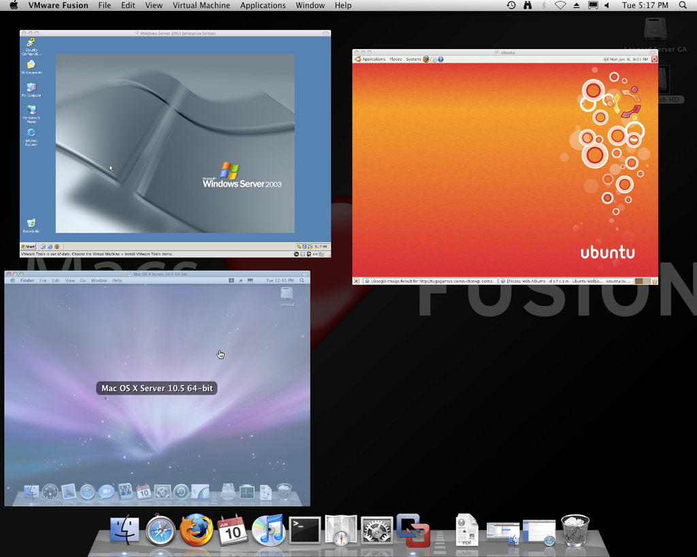
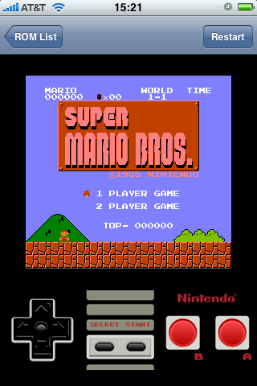
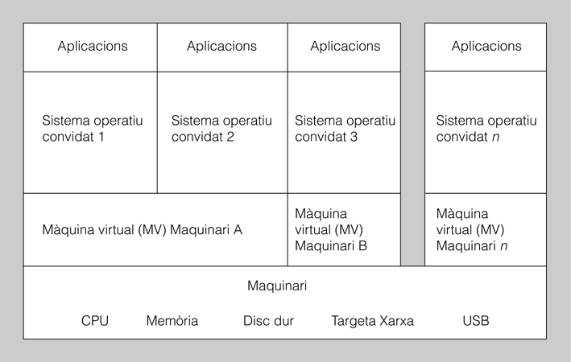

# Màquines virtuals

Resum: [https://gitpitch.com/jrodr236/som/master?p=uf1-maquines-virtuals](https://gitpitch.com/jrodr236/som/master?p=uf1-maquines-virtuals)

## Introducció

La virtualització dels sistemes informàtics no només s’aplica a petits equipaments, sinó que cada vegada s’utilitza més en molts àmbits relacionats amb el món de la informàtica.

## Maquina real i màquina virtual

Una **màquina real** \(o **física**\) és un ordinador que té elements físics dins d’una arquitectura coneguda. S’obtenen els millors resultats referents a la velocitat de tractament de la informació.

Una **màquina virtual** \(o màquina **lògica**\) és una màquina que simula el funcionament d’una màquina real. Sobre ella es poden instal·lar sistemes operatius, aplicacions informàtiques, navegar de manera segura per Internet, utilitzar diversos dispositius \(per exemple, targetes de xarxa, dispositius USB, etc.\).

## Virtualització

La **virtualització** és un concepte que descriu la capacitat de tenir diversos sistemes operatius funcionant al mateix temps en un ordinador.

També podem definir una **màquina virtual \(Virtual Machine, VM\)** com un programari que simula una màquina real i on es poden executar programes informàtics com si fos una màquina real.

## Amfitrió i hoste

El sistema operatiu sobre el qual s’executa el programari per a crear les màquines virtuals s’anomena **amfitrió \(host\)**. Per exemple, els sistemes operatius Windows, Linux, MacOS.

Els diversos sistemes operatius instal·lats en cada màquina virtuals s’anomenen **hostes \(guest\)**.

## Tipus de màquines virtuals

Tenint en compte les funcionalitats de les màquines virtuals, les podem classificar en les següents categories:

* Màquines virtuals de sistema
* Màquines virtuals de procés
* Virtualització de recursos

### Màquines virtuals de sistema

També anomenades màquines virtuals de maquinari o virtualització de plataforma.

Permeten a la màquina física real simular-se en diverses màquines virtuals.

Cada màquina virtual executa el seu propi sistema operatiu.

La capa de programari que permet la virtualització s’anomena màquina virtual de maquinari o **monitor de màquina virtual**. Un monitor de màquina virtual es pot executar o bé directament sobre el maquinari, o bé sobre el sistema operatiu.

Tipus

* Emulació: simula plataformes de maquinari diferents.
* Virtualització completa o nativa: simula la mateixa plataforma de maquinari.
* Paravirtualització: mitjançant modificacions del sistema operatiu natiu, millora l'eficiència.

### Màquines virtuals de procés

A vegades anomenades màquines virtuals d’aplicacions.

S’executen com un procés normal dins d’un sistema operatiu i suporten un únic procés.

La màquina virtual s’inicia automàticament quan es llança el procés que s’ha d’executar i es para quan el procés finalitza.

El seu objectiu és proporcionar un entorn d’execució independent de la plataforma de maquinari i del sistema operatiu que amagui el maquinari real i permeti que un programa s’executi sempre de la mateixa manera sobre qualsevol plataforma.

Exemples:

* la màquina virtual Java \(JVM\), o Dalvik \(usat als dispositius Android\)

### Virtualització de recursos

Es virtualitzen recursos específics del sistema com, per exemple, la capacitat d’emmagatzematge, els recursos de la xarxa i els sistemes multiprocessador.

## Avantatges i inconvenients de les màquines virtuals

### Avantatges

* Consolidació de servidors: convertir molts servidors físics en virtuals, d’aquesta manera s’aprofita el maquinari disponible de la millor manera possible.
* Recuperació davant desastres: l’estat d’una màquina virtual es pot emmagatzemar en forma de fitxer i, per tant, en el cas de desastre es pot recuperar la informació amb rapidesa.
* Proves d’aplicacions: moltes vegades es necessita un entorn per a provar una aplicació. Utilitzar una màquina virtual permet instal·lar un sistema operatiu des de zero, provar aplicacions i després eliminar la màquina.
* Execució d’entorns complets sense instal·lació i configuració: la possibilitat de descarregar màquines virtuals des d’Internet permet estalviar temps en instal·lacions i configuracions
* Aplicacions portàtils: amb l’ús de les màquines virtuals es poden tenir PC completament preparats per a ser utilitzats en dispositius USB, la qual cosa pot ser d’una gran utilitat per a tenir un entorn privat i utilitzarlo en qualsevol PC.

### Inconvenients

* Afegeixen una gran complexitat al sistema en temps d’execució. Això té com a efecte l’alentiment del sistema, és a dir, el programari no s’executarà amb la mateixa velocitat que en una màquina real.
* Una màquina virtual reservarà recursos de maquinari de la màquina amfitrió en el moment de la seva posada en funcionament. Típicament, aquests recursos són en forma de memòria RAM i espai de disc dur que no estaran disponibles per al sistema operatiu amfitrió. Una vegada la màquina virtual es para, la memòria RAM utilitzada per la màquina virtual queda lliure però no l’espai de disc dur que continuarà reservat per a la màquina virtual, ja que conté els fitxers que permeten al sistema operatiu hoste executar-se.

## Instal·lació de programari gestor de màquines virtuals

